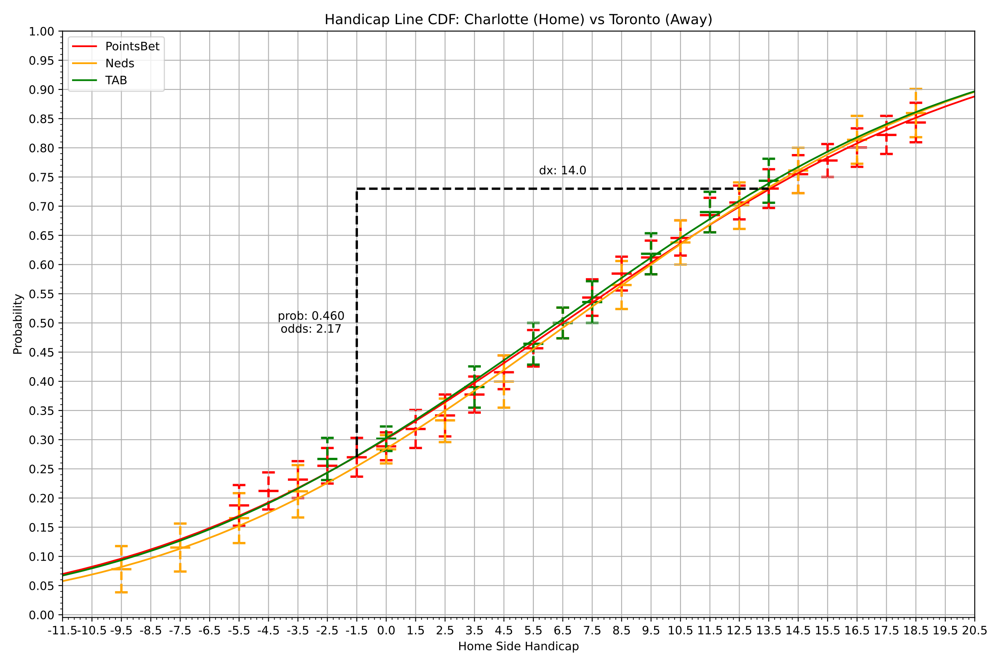

# Sports Distribution Analysis
Tools relating to the analysis of sports point distributions. 

## Features
- Fetch real-time odds through bookmaker APIs.
- Visualise bookmaker quotes in the probability space for all handicap/line bets.
- Model distributional probabilities of win margins by fitting normal distributions to bookmaker implied probabilities.
- Interactive visual tool to price arbitrary point spreads.
- Interact with bookmaker same game multi bet pricing APIs to query prices for all possible point spreads and identify potential mispricings and positive EV opportunities.

## Example

